# TRACK_GRAPH_TERMINUS.md — Delegation Track Graph through Project Terminus

**DOC-108** | Created: 2026-04-17  
**Status**: Active — canonical delegation map  
**Purpose**: Dependency-aware track graph that enables parallel team delegation from today through project terminus (Winter 2026 LG Content Store ship). Each track node bundles a set of roadmaps that share dependencies, touch the same engine subsystems, and can be owned by one team without blocking other tracks. The Game Design Document (§1) is the single north star — every track exists to serve one of its five pillars.

**Complements, does not replace:**
- `POST_JAM_FOLLOWUP_ROADMAP.md` (DOC-105) — the wave-by-wave execution plan (what to do when)
- `DOC_GRAPH_BLOCKOUT_ARC.md` (DOC-104) — the arc-scoped doc reading graph (what to read before coding)
- `TABLE_OF_CONTENTS_CROSS_ROADMAP.md` — the full doc index (where everything lives)

This document answers a different question: **who can work on what in parallel, and what blocks them?**

---

## 0. How to use this

1. **Find your track** in the graph below (§2) or the track table (§3).
2. Read the track's **roadmap set** — the bundled docs that define the work.
3. Check the track's **upstream dependencies** — if the upstream track hasn't exited its gate, you are blocked.
4. Check the track's **DOC-105 wave mapping** — this tells you *when* the work is sequenced.
5. Ship the track's exit criteria, then notify downstream tracks that they're unblocked.

Tracks are **delegation units** — a team of 1–3 contributors owns a track end-to-end. Cross-track interfaces are narrow and documented in §4.

---

## 1. Game Design Document — The Five Pillars

Every track exists to serve one of these pillars. If work doesn't trace back to a pillar, it's either polish (Pillar 5) or cut.

| # | Pillar | One-liner | Primary design source |
|---|--------|-----------|----------------------|
| **P1** | **Clean** | The dungeon is trashed. Make it spotless. | DOC-7 §2 Pillar 1, DOC-48 (pressure washing), DOC-59 (D3 balance) |
| **P2** | **Restock** | The crates are empty. Fill them back up. | DOC-7 §2 Pillar 2, DOC-57 (CrateUI), DOC-68 (work orders), DOC-39 (shop economy) |
| **P3** | **Endure** | Heroes are coming. Survive the cycle. | DOC-7 §2 Pillar 3, DOC-16 (suit system), DOC-74 (Act 2), DOC-75 (hero encounter) |
| **P4** | **Discover** | Environmental storytelling reveals the conspiracy. | DOC-13 (Street Chronicles), DOC-74 (Act 2), DOC-107 (quest system), DOC-9 (NPC system) |
| **P5** | **Polish & Ship** | Make it real, make it run on LG. | DOC-1 (deployability), DOC-21 (game flow), DOC-22/23 (HUD/UI), DOC-37 (input), Phase G |

The **world structure** (Biome Plan v5, DOC-4) and **core loop** (DOC-7) are shared foundations that every track reads but no track owns. They're frozen design — changes require designer sign-off.

---

## 2. The Track Graph

```mermaid
flowchart TB
    %% ============ DESIGN FOUNDATIONS (shared, no team owns) ============
    subgraph FOUNDATION["🎯 Design Foundations (frozen — designer owns)"]
        direction LR
        GDD["<b>Game Design Document</b><br/>DOC-7 Core Loop · DOC-4 Biome Plan<br/>DOC-13 Street Chronicles · DOC-74 Act 2"]:::foundation
    end

    %% ============ TRACK A: WORLD ============
    subgraph TRACK_A["🗺️ Track A — World & Blockout"]
        direction TB
        A1["<b>A1: Tile Library</b><br/>tiles.js · biome-map.json<br/>DOC-84 §1 · DOC-86 D-1/D-2<br/>DOC-95 minigame tiles"]:::track_a
        A2["<b>A2: Blockout Refresh</b><br/>floor-blockout-*.js · floor-manager.js<br/>BLOCKOUT_REFRESH_PLAN · DOC-104<br/>DOC-49 alignment · DOC-53 procedure"]:::track_a
        A3["<b>A3: Architecture</b><br/>door-sprites.js · spatial-contract.js<br/>DOC-88 doors · DOC-89 trapdoors<br/>DOC-92 windows · DOC-73 shapes"]:::track_a
        A4["<b>A4: Floor Content</b><br/>floor-blockout-2.js · floor-blockout-3.js<br/>DOC-61 F2 prep · DOC-79 F3 crosshair<br/>DOC-80 Seaway · Biome Plan §F4"]:::track_a
    end

    %% ============ TRACK B: RENDERER ============
    subgraph TRACK_B["🎨 Track B — Renderer & Visual"]
        direction TB
        B1["<b>B1: Raycaster Core</b><br/>raycaster.js + 6 sub-modules<br/>DOC-91 extraction · DOC-87 freeform<br/>DOC-18 N-layer"]:::track_b
        B2["<b>B2: Textures & Lighting</b><br/>texture-atlas.js · lighting.js<br/>DOC-14 textures · DOC-31a light/torch<br/>DOC-8 visual overhaul"]:::track_b
        B3["<b>B3: Skybox & Weather</b><br/>skybox.js · weather.js (future)<br/>DOC-17 skybox Ph 2–5<br/>DOC-101 weather module"]:::track_b
        B4["<b>B4: Sprites</b><br/>ui-sprites.js · sprite defs<br/>DOC-15 sprite stack · DOC-42 stubs<br/>DOC-41 library · DOC-40 commissioning"]:::track_b
    end

    %% ============ TRACK C: NPC & NARRATIVE ============
    subgraph TRACK_C["🧑‍🤝‍🧑 Track C — NPC & Narrative"]
        direction TB
        C1["<b>C1: NPC Core</b><br/>npc-system.js · npc-dialogue-trees.js<br/>DOC-9 NPC system §5–§9<br/>DOC-83 verb field · DOC-85 D3 AI"]:::track_c
        C2["<b>C2: Faction & Reputation</b><br/>quest-chain.js · quest-registry.js<br/>DOC-107 quest system Ph 2–7<br/>DOC-84 §15 faction model"]:::track_c
        C3["<b>C3: Barks & Dialogue</b><br/>tooltip system · bark renderer<br/>DOC-32b tooltip bark · DOC-50 spatial audio<br/>DOC-44 tooltip canon"]:::track_c
        C4["<b>C4: Narrative Content</b><br/>quests.json · dialogue trees<br/>DOC-74 Act 2 · DOC-75 hero encounter<br/>DOC-13 Street Chronicles"]:::track_c
    end

    %% ============ TRACK D: ECONOMY & SYSTEMS ============
    subgraph TRACK_D["💰 Track D — Economy & Game Systems"]
        direction TB
        D1["<b>D1: Cleaning Loop</b><br/>readiness-calc.js · hazard-system.js<br/>DOC-52 readiness bar · DOC-59 D3 balance<br/>DOC-48 pressure washing · DOC-31b traps"]:::track_d
        D2["<b>D2: Shop & Restock</b><br/>shop.js · restock system<br/>DOC-39 shop refresh · DOC-57 CrateUI<br/>DOC-68 work orders · DOC-70 restock surface"]:::track_d
        D3["<b>D3: Cards & Combat</b><br/>card-authority.js · combat-engine.js<br/>DOC-16 suit system · DOC-20 combat drag<br/>DOC-62 post-jam items"]:::track_d
        D4["<b>D4: Minigames</b><br/>minigame-registry (future)<br/>MINIGAME_ROADMAP · DOC-95 tiles<br/>DOC-106 raycaster pause/resume"]:::track_d
    end

    %% ============ TRACK E: PLATFORM & POLISH ============
    subgraph TRACK_E["📦 Track E — Platform & Ship"]
        direction TB
        E1["<b>E1: HUD & UI</b><br/>hud.js · menu-faces.js · screen-manager.js<br/>DOC-22 HUD · DOC-23 UI · DOC-34 overhaul<br/>DOC-12 peek system · DOC-55 menu catalog"]:::track_e
        E2["<b>E2: Input & Controls</b><br/>input-manager.js · movement-controller.js<br/>DOC-37 input controller · DOC-38 player controller<br/>Magic Remote · gamepad"]:::track_e
        E3["<b>E3: Audio</b><br/>audio-system.js<br/>DOC-6 audio engine · DOC-50 spatial bark<br/>DOC-60/81 SFX commissioning"]:::track_e
        E4["<b>E4: LG Submission</b><br/>manifest · scaling · webOS<br/>DOC-1 deployability T2 · DOC-33 gap analysis<br/>DOC-21 game flow · Phase G"]:::track_e
    end

    %% ============ TRACK F: TOOLS ============
    subgraph TRACK_F["🔧 Track F — Tooling"]
        direction TB
        F1["<b>F1: Blockout Tools</b><br/>blockout-visualizer.html · blockout-cli.js<br/>BO-V README · short-roadmap.md<br/>extract-floors.js"]:::track_f
        F2["<b>F2: BoxForge / Peek Workbench</b><br/>peek-workbench.html · boxforge.html<br/>DOC-98/99/100 BoxForge audit/next/roadmap<br/>DOC-77/78 box editor"]:::track_f
        F3["<b>F3: Test Harness</b><br/>test-harness.html · debug overlay<br/>DOC-96 test harness · DOC-94 spatial debug<br/>DOC-35 debug screener"]:::track_f
    end

    %% ============ TERMINUS ============
    TERMINUS["<b>🏁 PROJECT TERMINUS</b><br/>Winter 2026 — LG Content Store<br/>webOS TV app · Magic Remote<br/>Fresh bug-free build"]:::terminus

    %% ============ FOUNDATION → TRACKS ============
    GDD --> A1
    GDD --> C1
    GDD --> D1
    GDD --> C4

    %% ============ TRACK A INTERNAL ============
    A1 --> A2
    A2 --> A4
    A3 --> A2

    %% ============ TRACK B INTERNAL ============
    B1 --> B2
    B2 --> B3

    %% ============ TRACK C INTERNAL ============
    C1 --> C2
    C1 --> C3
    C2 --> C4
    C3 --> C4

    %% ============ TRACK D INTERNAL ============
    D1 --> D2
    D3 --> D2

    %% ============ TRACK E INTERNAL ============
    E1 --> E4
    E2 --> E4
    E3 --> E4

    %% ============ CROSS-TRACK DEPENDENCIES ============
    A1 -->|"tiles defined"| B2
    A1 -->|"verb-node tiles"| D4
    A2 -->|"floors placed"| C1
    A2 -->|"floors placed"| D1
    A3 -->|"door/window arch"| B1
    B1 -->|"freeform render"| A3
    C1 -->|"NPC schedules"| D2
    C2 -->|"quest hooks"| D4
    D1 -->|"readiness data"| C2
    D2 -->|"economy tuned"| C4
    D4 -->|"minigame UI"| E1
    F1 -->|"grid edits"| A2
    F2 -->|"peek descriptors"| E1
    F3 -->|"perf gates"| B1

    %% ============ TO TERMINUS ============
    A4 --> TERMINUS
    B3 --> TERMINUS
    B4 --> TERMINUS
    C4 --> TERMINUS
    D2 --> TERMINUS
    D3 --> TERMINUS
    D4 --> TERMINUS
    E4 --> TERMINUS

    %% ============ STYLES ============
    classDef foundation fill:#fef3c7,stroke:#b45309,stroke-width:3px,color:#000
    classDef track_a fill:#dbeafe,stroke:#1e40af,stroke-width:2px,color:#000
    classDef track_b fill:#f3e8ff,stroke:#6b21a8,stroke-width:2px,color:#000
    classDef track_c fill:#d1fae5,stroke:#047857,stroke-width:2px,color:#000
    classDef track_d fill:#fce7f3,stroke:#9d174d,stroke-width:2px,color:#000
    classDef track_e fill:#e0e7ff,stroke:#3730a3,stroke-width:2px,color:#000
    classDef track_f fill:#fff7ed,stroke:#c2410c,stroke-width:2px,color:#000
    classDef terminus fill:#fecaca,stroke:#991b1b,stroke-width:4px,color:#000
```



---

## 3. Track Inventory — Full Roadmap Sets

### Track A — World & Blockout 🗺️

**Pillars served**: P1 (Clean) + P2 (Restock) + P3 (Endure) — the physical world everything else sits on  
**DOC-105 waves**: Wave 1 (prereqs) + Wave 2 (execution)  
**Team size**: 1–2 (blockout editor is single-threaded per floor)

| Node | Roadmap Set | Key Deliverables | Gate (blocked until) | Exit Criteria |
|------|-------------|------------------|---------------------|---------------|
| **A1** | DOC-84 §1 (tile prereqs), DOC-86 §3 D-1/D-2/D-3, DOC-95 (minigame tiles) | Tiles 40–59 in tiles.js + biome wiring + texture keys | GDD frozen | All tile IDs render with textures on all biomes |
| **A2** | BLOCKOUT_REFRESH_PLAN, DOC-104 arc graph, DOC-49 (alignment), DOC-53 (procedure), DOC-31b (cobweb/trap phases 3/5–7) | Floors 0–3 blockout refreshed, verb-nodes placed, trap/cobweb tiles strategic | A1 exit + A3 arch available | Blockout refresh plan §1–§8 shipped |
| **A3** | DOC-88 (doors Ph 3), DOC-89 (trapdoors T6–8), DOC-92 (windows Ph 6–7), DOC-73 (shapes) | Arch variants, trapdoor tiers, EmojiMount, surface-mount tiles | A1 exit (tile IDs) | Arch/trapdoor/window variants ship or explicitly re-defer |
| **A4** | DOC-61 (F2 prep), DOC-79 (F3 crosshair), DOC-80 (Seaway), Biome Plan §F4 | Floor 2 full blockout, Floor 3 Frontier Gate, Floor 4 concept | A2 exit | Act 2 floors navigable end-to-end |

### Track B — Renderer & Visual 🎨

**Pillars served**: All (rendering is universal infrastructure)  
**DOC-105 waves**: Wave 2 (raycaster polish), Wave 6 (skybox/sprites)  
**Team size**: 1 (hot-path sensitive, needs perf measurement per change)

| Node | Roadmap Set | Key Deliverables | Gate | Exit Criteria |
|------|-------------|------------------|------|---------------|
| **B1** | DOC-91 (extraction Ph 1–3 ✅, Ph 4 deferred), DOC-87 (freeform), DOC-18 (N-layer) | Raycaster sub-module stability, freeform wall blocks | F3 perf baseline | ≤2% framerate regression vs. baseline |
| **B2** | DOC-14 (textures), DOC-31a (light/torch post-jam), DOC-8 (visual overhaul) | Texture atlas for tiles 40–59, lighting polish | A1 exit (tile IDs + texture keys) | All live tiles render correct textures, no flat-color fallbacks |
| **B3** | DOC-17 (skybox Ph 2–5), DOC-101 (weather) | Celestial bodies, star parallax, weather system | A4 exit (Floor 3 blockout for ocean integration) | Skybox/weather renders on all exterior floors |
| **B4** | DOC-15 (sprite stack), DOC-42 (stubs), DOC-41 (library), DOC-40 (commissioning) | Triple emoji → artist sprite migration | Artist sprites available | Sprite composition system functional, key NPCs + enemies ported |

### Track C — NPC & Narrative 🧑‍🤝‍🧑

**Pillars served**: P3 (Endure) + P4 (Discover)  
**DOC-105 waves**: Wave 3 (NPC refresh) + Wave 4 (faction economy) + Wave 5 (hero encounter)  
**Team size**: 1–2 (systems track + content/writing track can parallelize)

| Node | Roadmap Set | Key Deliverables | Gate | Exit Criteria |
|------|-------------|------------------|------|---------------|
| **C1** | DOC-9 §5–§9 (NPC types), DOC-83 (verb field Ph 11), DOC-85 (D3 AI), DOC-86 CP3/CP4 | Vendor barks, building assignment, hero NPCs, cross-floor verb attenuation, D3 proc-gen reliability | A2 exit (verb-nodes placed) | NPCs use verb-nodes on schedule without dead-node starvation; D3 proc-gen passes acceptance tests |
| **C2** | DOC-107 (quest system Ph 2–7), DOC-84 §15 (faction model), DOC-86 CP5 | Journal UI, reputation bars, faction rank effects, quest JSON content | C1 exit (NPC schedules) + D1 data (readiness) | Faction rank changes produce observable shop/NPC behavior deltas |
| **C3** | DOC-32b (tooltip bark Ph 2–3), DOC-50 (spatial audio Ph 0–3), DOC-44 (tooltip canon) | Scrollable bark log, inline NPC choices, stereo panning, bark direction | C1 exit (NPC variety) | NPC barks are persistent (log) + directional (stereo) |
| **C4** | DOC-74 (Act 2), DOC-75 (hero encounter), DOC-13 (Street Chronicles), quests.json | Act 2 housing arc, hero boss encounter, faction quest content | C2 exit + D2 exit (economy context) | Act 2 playable end-to-end; hero encounter cinematic functional |

### Track D — Economy & Game Systems 💰

**Pillars served**: P1 (Clean) + P2 (Restock) + P3 (Endure)  
**DOC-105 waves**: Wave 1 (cobweb prereqs) + Wave 2 (readiness bar) + Wave 3 (D3 balance) + Wave 4 (shops/economy)  
**Team size**: 1–2 (cleaning/combat can split from shop/economy)

| Node | Roadmap Set | Key Deliverables | Gate | Exit Criteria |
|------|-------------|------------------|------|---------------|
| **D1** | DOC-52 (readiness bar FX + reporting), DOC-59 (D3 cleaning balance), DOC-48 (PW gauge), DOC-31b (cobweb/trap readiness) | Constellation-tracer FX, morning reporting, D3 readiness weights, pressure gauge HUD | A2 exit (floors to measure readiness on) | Readiness bar visually juicy + reports delivered to mailbox |
| **D2** | DOC-39 (shop refresh), DOC-57 (CrateUI overhaul), DOC-68 (work orders), DOC-70 (restock surface), DOC-86 CP5 | Staggered shop cycles, faction scarcity, work-order crate deposits, economy tuning | C1 exit (NPC schedules drive shop restock) + D3 (card drops weighted) | Shops restock based on NPC activity; faction rank → shop behavior |
| **D3** | DOC-16 (suit system 4 remaining passes), DOC-20 (combat drag), DOC-62 (buff items), DOC-26 (metadata contract) | Suit synergies, biome-weighted drops, faction suit affinities, 5 buff items | A1 exit (creature tiles for drop tables) | Card drops weighted by biome/faction; suit synergy loop closed |
| **D4** | MINIGAME_ROADMAP, DOC-95 (minigame tiles), DOC-106 (raycaster pause/resume) | Minigame registry, Tier 1 kinds (well/anvil/soup/barrel/fungal), work-order hooks | A1 exit (tiles) + C2 data (quest hooks) + E1 (peek system) | 5 Tier 1 minigames playable with 3-input-tier parity |

### Track E — Platform & Ship 📦

**Pillars served**: P5 (Polish & Ship)  
**DOC-105 waves**: Wave 5 (parallel to 3/4) + Wave 6 (post-April-25)  
**Team size**: 1–2 (UI track + LG/audio track can split)

| Node | Roadmap Set | Key Deliverables | Gate | Exit Criteria |
|------|-------------|------------------|------|---------------|
| **E1** | DOC-22 (HUD), DOC-23 (UI), DOC-34 (unified UI), DOC-12 (peek system), DOC-55 (menu catalog) | HUD layout final pass, peek animation polish, menu face consistency | D4 minigame UI needs | All peek/HUD/menu faces render correctly at 1920×1080 |
| **E2** | DOC-37 (input controller), DOC-38 (player controller), DOC-48 §12 (gyro aim) | Gamepad parity, Magic Remote final pass, gyro aim | None (can start anytime) | All input methods equivalent; Magic Remote fully functional |
| **E3** | DOC-6 (audio engine), DOC-50 (spatial bark Ph 0–1), DOC-60/81 (SFX commissioning) | Missing SFX, volume balancing, stereo panning integration | C3 exit (bark system ready) | No missing SFX; spatial audio functional |
| **E4** | DOC-1 T2 (deployability), DOC-33 (gap analysis refresh), DOC-21 (game flow), Phase G | LG 1920×1080 scaling, webOS manifest, save/load stubs, submission metadata | E1 + E2 + E3 exit | LG Content Store submission-ready build |

### Track F — Tooling 🔧

**Pillars served**: Meta — accelerates all other tracks  
**DOC-105 waves**: Always-on, not wave-gated  
**Team size**: 1 (shared tooling, ad-hoc improvements)

| Node | Roadmap Set | Key Deliverables | Gate | Exit Criteria |
|------|-------------|------------------|------|---------------|
| **F1** | BO-V README, short-roadmap.md, blockout-cli.js, extract-floors.js | Grid editing pipeline, CLI for agent-driven blockout | None | Track A can edit floors without hand-editing IIFEs |
| **F2** | DOC-98/99/100 (BoxForge), DOC-77/78 (box editor/peek workbench) | Peek descriptor editor, orb/phase/sub-attachment support | None | Peek descriptors authorable without editing JS |
| **F3** | DOC-96 (test harness), DOC-94 (spatial debug), DOC-35 (debug screener) | DebugPerfMonitor, subsystem probes, test floor gallery | None | Perf regression detectable per-commit |

---

## 4. Cross-Track Interfaces

These are the narrow handoff points between tracks. Each interface is a data contract or module API — not a "go talk to the other team" meeting.

| Interface | From → To | Contract | How to verify |
|-----------|-----------|----------|---------------|
| **Tile IDs** | A1 → B2, D4 | `TILES` constants in tiles.js, texture keys in biome-map.json | `bo validate --floor *` passes; no flat-color fallbacks in raycaster |
| **Floor grids** | A2 → C1, D1 | `floor-blockout-*.js` IIFEs with GRID + SPAWN + doorTargets | `node tools/extract-floors.js` succeeds; floor-data.json current |
| **Door/arch geometry** | A3 ↔ B1 | `SpatialContract.tileFreeform` + `DoorSprites` face cache | `Raycaster.renderColumn()` draws correct freeform for new tile types |
| **NPC schedules** | C1 → D2 | `NpcSystem.getSchedule(npcId, day)` → verb-node consumption | NPCs visible at verb-node tiles during playtest walk |
| **Readiness data** | D1 → C2 | `ReadinessCalc.getTierCross()` events + `QuestChain.onReadinessChange()` | Quest advances on readiness tier-cross; journal updates |
| **Quest hooks** | C2 → D4 | `QuestChain.onMinigameComplete(kind, result)` | Minigame completion advances quest step |
| **Economy** | D2 → C4 | Shop inventory state, faction rank → visible NPC behavior | Faction rank changes produce different shop stock |
| **Minigame UI** | D4 → E1 | PeekSystem variant-registry + minigame mount/unmount lifecycle | Minigame renders inside peek box at correct resolution |
| **Peek descriptors** | F2 → E1 | `peekDescriptors.json` exported from BoxForge | Peek boxes render new descriptors without code change |
| **Perf baselines** | F3 → B1 | DebugPerfMonitor FPS threshold + stutter log | Raycaster changes that breach threshold are flagged |

---

## 5. DOC-105 Wave → Track Mapping

Shows how the time-ordered waves (DOC-105) map to the dependency-ordered tracks. A team picks up their track and follows the wave gate schedule.

| DOC-105 Wave | Primary Track(s) | Secondary Track(s) | Notes |
|-------------|-----------------|-------------------|-------|
| **Wave 1** — Blockout Prereqs | **A1**, **A3** | D1 (cobweb phases), F1 (CLI ready) | Track A owns the critical path |
| **Wave 2** — Blockout Execution | **A2** | B1/B2 (raycaster + textures), D1 (readiness bar), F1 | Tracks B and D ride along on same files |
| **Wave 3** — NPC Refresh | **C1**, **C3** | D1 (D3 balance), A4 (floor content starts) | Track C owns; Track D cleans up D3 tuning |
| **Wave 4** — Living Shops | **D2**, **D3** | C2 (faction quest content), C4 (narrative) | Economy payoff — Track D owns; Track C writes content |
| **Wave 5** — Legacy & Polish | **E1**–**E4** | C4 (hero encounter), D4 (minigames) | Track E runs parallel to Wave 3/4 where possible |
| **Wave 6** — Deferred Polish | **B3**, **B4** | E4 (final submission), all tracks (bug fixes) | Post-April-25; pull from pile as bandwidth allows |

---

## 6. Critical Path to Terminus

The longest dependency chain through the graph — the path that, if delayed, delays the project terminus.

```
GDD (frozen)
 └─► A1: Tile Library           [Wave 1]
      └─► A2: Blockout Refresh   [Wave 2]
           └─► C1: NPC Core       [Wave 3]
                └─► C2: Quests     [Wave 3–4]
                     └─► D2: Shops  [Wave 4]
                          └─► C4: Narrative Content  [Wave 4–5]
                               └─► E4: LG Submission  [Wave 5]
                                    └─► 🏁 TERMINUS
```

**Parallel tracks that DON'T sit on the critical path** (can absorb delay without slipping terminus):
- Track B (renderer) — rides alongside Track A, but renderer regressions just re-defer to Wave 6
- Track D3 (cards/combat) — feeds into D2 but has its own cadence
- Track D4 (minigames) — cool but not blocking submission
- Track E1–E3 (HUD/input/audio) — runs parallel to Wave 3/4
- Track F (tooling) — always-on accelerator

**Implication**: The critical path runs through world → NPC → economy → narrative → submission. Assign your strongest contributor to Tracks A → C → D2 → E4 in sequence, and let everyone else parallelize around them.

---

## 7. Milestones

| Date | Milestone | Tracks Exiting | What's Playable |
|------|-----------|---------------|-----------------|
| **Apr 21** | Blockout Refresh shipped | A1, A2, A3 | Floors 0–3 fully tiled, verb-nodes placed, textures rendering |
| **Apr 25** | Fresh bug-free build (post-jam voting) | B1, B2, D1, F1 | Readiness bar polished, raycaster stable, tools functional |
| **May** | NPC Refresh + D3 tuning | C1, C3, D1 (D3) | NPCs on schedule, barks persistent, D3 cleaning loop distinct |
| **Jun** | Living Shops & Economy | C2, D2, D3 | Shops restock from NPC activity, faction ranks affect gameplay |
| **Jul** | Act 2 content complete | C4, A4 | Act 2 playable end-to-end, hero encounter functional |
| **Aug–Sep** | Minigame arc | D4, E1 | 5 Tier 1 minigames playable |
| **Oct** | LG submission prep | E2, E3, E4 | Audio complete, input final, 1920×1080 scaling |
| **Nov** | Polish & submission | B3, B4 | Skybox/weather, artist sprites where available |
| **Winter 2026** | **🏁 LG Content Store ship** | All | Full game on webOS |

---

## 8. How to delegate

1. **Assign a track lead** per track (A–F). Track lead owns the roadmap set, gate check-ins, and exit sign-off.
2. **Cross-track sync**: Weekly 15-min standup per cross-track interface (§4). One sentence: "I shipped X, you're unblocked on Y."
3. **Escalation**: If a gate is missed, the blocked track lead flags it in DOC-105 and the wave shifts. No silent waiting.
4. **New work intake**: All new roadmaps get a DOC number in the TOC, get triaged into a track + wave in this doc, and get registered in DOC-105. No doc lives only in the TOC.
5. **Archive protocol**: When a track node exits, mark it ✅ here and in DOC-105. Move completed source docs to `docs/Archive/` per DOC-105 Appendix A.

---

## 9. Cross-references

- **Execution plan (wave sequencing)**: `POST_JAM_FOLLOWUP_ROADMAP.md` (DOC-105)
- **Blockout arc reading graph**: `DOC_GRAPH_BLOCKOUT_ARC.md` (DOC-104)
- **Full doc index**: `TABLE_OF_CONTENTS_CROSS_ROADMAP.md`
- **Legacy dependency chain**: `LEGACY_ROADMAP_CRITICAL_PATH.md` (DOC-86)
- **Core game design**: `CORE_GAME_LOOP_AND_JUICE.md` (DOC-7) + `Biome Plan.html` (DOC-4)
- **Narrative design**: `STREET_CHRONICLES_NARRATIVE_OUTLINE.md` (DOC-13) + `ACT2_NARRATIVE_OUTLINE.md` (DOC-74)
- **Code exploration**: `code-review-graph` MCP tools before touching engine files

---

## 10. Maintenance

- Update this doc when a new track or node is created.
- When a node exits, mark it ✅ and update the milestone table.
- When a cross-track interface changes, update §4 so downstream tracks aren't surprised.
- This doc survives arc boundaries — it's scoped to terminus, not to the blockout arc. When DOC-104 archives, this doc stays.
- Next DOC number after this: **DOC-109**.
